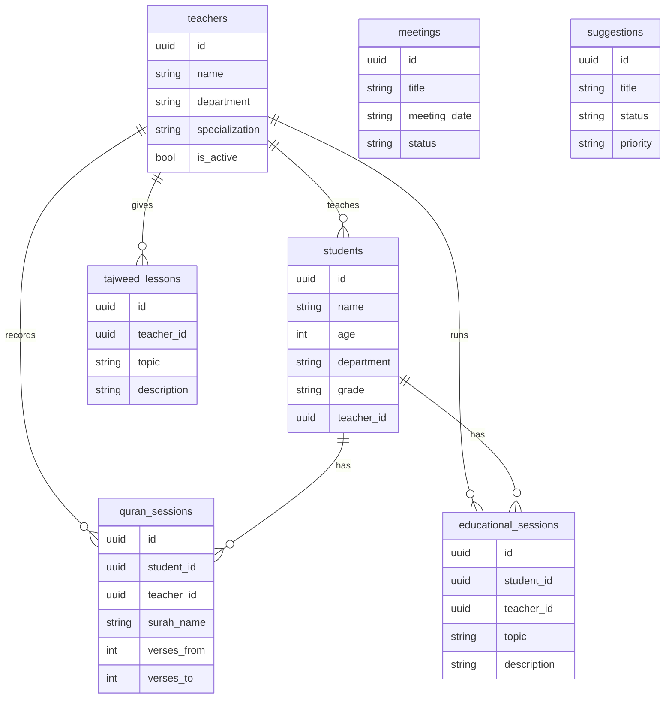
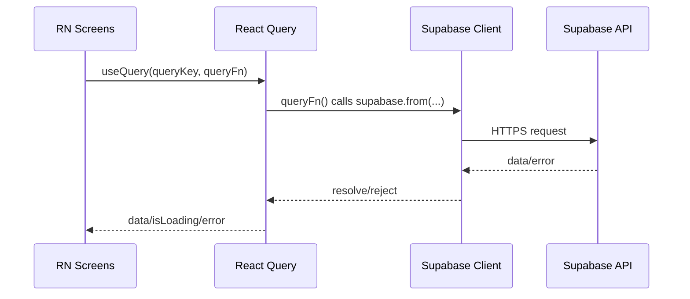

# Eqraa Center Hub - Mobile App Plan (Expo/React Native)

## 1) Goal

Build an Expo (React Native) mobile app that mirrors the web app in **look & feel**, **Arabic RTL**, and **full functionality** with all 16+ features.

**Web Reference Implementation:**
- Home dashboard: [`Index`](../src/views/Index.tsx:153)
- Auth UI: [`Login()`](../src/views/Login.tsx:16)
- Route protection: [`ProtectedLayout()`](../app/(protected)/layout.tsx:7)
- Home stats: [`useHomeStats()`](../src/hooks/useHomeStats.ts:82)
- Supabase types: [`Database`](../src/integrations/supabase/types.ts:9)

---

## 2) Scope

### In Scope
- **Platforms**: Android + iOS
- **Framework**: Expo SDK 52+
- **Routing**: Expo Router (file-based)
- **Auth**: Supabase Auth (email/password)
- **Session**: AsyncStorage persistence
- **State**: React Query + React Hook Form + Zod
- **Styling**: NativeWind (Tailwind-like)
- **Arabic RTL**: I18nManager + Noto Sans Arabic
- **Theming**: Light/dark with persistence
- **Features**: All 16+ sections with full CRUD

### Phased Rollout
- **Phase 1-4**: Foundation + Auth + UI + Home (read-only data)
- **Phase 5-7**: Full CRUD for Students, Quran, Educational, Management
- **Phase 8**: Polish + Release

---

## 3) Navigation Architecture

### 5 Bottom Tabs

| Tab | Name | Screens |
|-----|------|---------|
| 1 | الرئيسية (Home) | Dashboard, Stats, Quick Navigation Grid |
| 2 | القرآن (Quran) | Sessions, Tajweed, Circles, Progress |
| 3 | الطلاب (Students) | List, Details, Attendance, Grades |
| 4 | الإدارة (Management) | Teachers, Exams, Schedule, Subjects, Meetings, Announcements, Library, Suggestions |
| 5 | الإعدادات (Settings) | Profile, Theme, Logout |

### Route Structure (Expo Router)

```
mobile/app/
├── _layout.tsx                 # Root layout with providers
├── (auth)/
│   ├── login.tsx
│   └── signup.tsx
├── (tabs)/
│   ├── _layout.tsx            # Tab bar configuration
│   ├── index.tsx              # Home/Dashboard
│   ├── quran/
│   │   ├── _layout.tsx
│   │   ├── index.tsx          # Sessions list
│   │   ├── tajweed.tsx
│   │   └── circles.tsx
│   ├── students/
│   │   ├── _layout.tsx
│   │   ├── index.tsx          # Students list
│   │   └── [id].tsx           # Student detail
│   ├── management/
│   │   ├── _layout.tsx
│   │   ├── index.tsx          # Management hub
│   │   ├── teachers.tsx
│   │   ├── exams.tsx
│   │   ├── schedule.tsx
│   │   ├── attendance.tsx
│   │   ├── announcements.tsx
│   │   ├── meetings.tsx
│   │   └── suggestions.tsx
│   └── settings/
│       ├── _layout.tsx
│       ├── index.tsx
│       └── profile.tsx
└── +not-found.tsx
```

### Navigation Flow

```mermaid
flowchart TD
  A[App Start] --> B{Session exists?}
  B -- No --> C[(auth)/login]
  C --> D[(auth)/signup]
  B -- Yes --> E[(tabs)/home]

  E --> F[(tabs)/quran]
  E --> G[(tabs)/students]
  E --> H[(tabs)/management]
  E --> I[(tabs)/settings]

  F --> F1[Sessions]
  F --> F2[Tajweed]
  F --> F3[Circles]

  G --> G1[Student List]
  G1 --> G2[Student Detail]

  H --> H1[Teachers]
  H --> H2[Exams]
  H --> H3[Schedule]
  H --> H4[Meetings]
  H --> H5[Suggestions]
```

---

## 4) Project Structure

```
mobile/
├── app/                        # Expo Router screens
│   ├── (auth)/
│   ├── (tabs)/
│   └── _layout.tsx
├── src/
│   ├── components/
│   │   ├── ui/                # Button, Card, Input, Select, Dialog, Avatar, Badge
│   │   ├── common/            # PageHeader, StatCard, IconButton, LoadingSpinner
│   │   ├── forms/             # FormField, PasswordInput, SearchInput
│   │   └── features/          # students/, teachers/, quran/
│   ├── hooks/                 # useHomeStats, useUserRole, useAuth, useTheme
│   ├── lib/                   # supabase, validations, utils
│   ├── types/                 # TypeScript types (from web)
│   ├── contexts/              # AuthContext, ThemeContext
│   ├── constants/             # colors, navigation, config
│   └── services/              # API service functions
├── assets/
│   └── fonts/NotoSansArabic/
├── app.json
├── tailwind.config.js
├── babel.config.js
└── package.json
```

---

## 5) Data Model (Supabase)

Same tables as web app:



---

## 6) Screen-to-Data Mapping

| Screen | Web Reference | Data to Show | Tables/Fields |
|--------|---------------|--------------|---------------|
| Home | [`Index`](../src/views/Index.tsx:153) + [`useHomeStats()`](../src/hooks/useHomeStats.ts:82) | Stats cards, navigation grid | `students`, `teachers`, `meetings` |
| Students | [`Students`](../src/views/Students.tsx) | List with search/filter, CRUD forms | `students.*`, `teachers.name` |
| Quran | [`Quran`](../src/views/Quran.tsx:54) | Sessions list, student progress | `students` (quran), `quran_sessions` |
| Tajweed | [`Tajweed`](../src/views/Tajweed.tsx:20) | Lessons list by date | `tajweed_lessons.*` |
| Educational | [`Educational`](../src/views/Educational.tsx:45) | Students (tarbawi), sessions | `students` (tarbawi), `educational_sessions` |
| Teachers | [`Teachers`](../src/views/Teachers.tsx) | Teachers list, CRUD forms | `teachers.*` |
| Meetings | [`Meetings`](../src/views/Meetings.tsx:38) | Meetings with status filter | `meetings.*` |
| Suggestions | [`Suggestions`](../src/views/Suggestions.tsx:24) | Suggestions with priority badges | `suggestions.*` |

---

## 7) Technical Architecture

### Data Flow



### Supabase Client (React Native)

```typescript
// src/lib/supabase.ts
import 'react-native-url-polyfill/auto';
import { createClient } from '@supabase/supabase-js';
import AsyncStorage from '@react-native-async-storage/async-storage';

export const supabase = createClient(SUPABASE_URL, SUPABASE_ANON_KEY, {
  auth: {
    storage: AsyncStorage,
    autoRefreshToken: true,
    persistSession: true,
    detectSessionInUrl: false,
  },
});
```

### RTL Arabic Support

```typescript
// app/_layout.tsx
import { I18nManager } from 'react-native';
I18nManager.allowRTL(true);
I18nManager.forceRTL(true);
```

---

## 8) Code Reuse from Web

### Files to Copy Directly
| Web Path | Mobile Path | Changes |
|----------|-------------|---------|
| `/src/types/index.ts` | `/src/types/index.ts` | None |
| `/src/lib/validations.ts` | `/src/lib/validations.ts` | None |
| `/src/integrations/supabase/types.ts` | `/src/types/supabase.ts` | None |
| `/src/hooks/useHomeStats.ts` | `/src/hooks/useHomeStats.ts` | Import paths |
| `/src/hooks/useUserRole.ts` | `/src/hooks/useUserRole.ts` | Import paths |

### UI Component Mapping (Shadcn → NativeWind)
| Shadcn Component | React Native Equivalent |
|-----------------|------------------------|
| Button | Pressable + NativeWind + CVA |
| Card | View with shadow styles |
| Input | TextInput + NativeWind |
| Select | @react-native-picker or custom modal |
| Dialog | React Native Modal |
| Table | FlatList with custom rows |
| Toast | react-native-toast-message |
| Avatar | Image + fallback View |
| Badge | View + Text with variants |

---

## 9) Dependencies

```json
{
  "expo": "~52.0.0",
  "expo-router": "~4.0.0",
  "react": "18.3.1",
  "react-native": "0.76.0",

  "@supabase/supabase-js": "^2.89.0",
  "@react-native-async-storage/async-storage": "^2.0.0",
  "react-native-url-polyfill": "^2.0.0",

  "@tanstack/react-query": "^5.90.0",
  "zod": "^4.2.1",
  "react-hook-form": "^7.69.0",
  "@hookform/resolvers": "^5.2.2",

  "nativewind": "^4.0.0",
  "tailwindcss": "^3.4.0",
  "class-variance-authority": "^0.7.1",
  "clsx": "^2.1.1",
  "tailwind-merge": "^3.4.0",

  "lucide-react-native": "^0.460.0",
  "expo-image-picker": "~16.0.0",
  "expo-secure-store": "~14.0.0",
  "react-native-toast-message": "^2.2.0",
  "date-fns": "^4.1.0"
}
```

---

## 10) Implementation Phases

### Phase 1: Foundation
- [ ] Initialize Expo project with TypeScript
- [ ] Configure NativeWind + Tailwind
- [ ] Set up Expo Router navigation structure
- [ ] Configure Supabase client with AsyncStorage
- [ ] Implement RTL support (I18nManager.forceRTL)
- [ ] Create ThemeContext (light/dark mode)
- [ ] Copy types and validations from web
- [ ] Load Arabic font (Noto Sans Arabic)

### Phase 2: Authentication
- [ ] Create Login screen (mirror web design)
- [ ] Create Signup screen
- [ ] Implement AuthContext with Supabase
- [ ] Set up protected route wrappers
- [ ] Implement session persistence
- [ ] Copy and adapt useUserRole hook

### Phase 3: Core UI Components
- [ ] Button (all variants)
- [ ] Card, Input, Select
- [ ] Dialog/Modal, Avatar, Badge
- [ ] Tabs, Toast notifications
- [ ] PageHeader, StatCard, IconButton
- [ ] LoadingSpinner, Skeleton, EmptyState

### Phase 4: Home Dashboard
- [ ] Dashboard layout with stats cards
- [ ] Navigation grid (16 sections)
- [ ] Announcements preview
- [ ] Pull-to-refresh
- [ ] Integrate useHomeStats hook

### Phase 5: Students Module
- [ ] Students list (FlatList with search/filter)
- [ ] Student detail screen
- [ ] Add/Edit student forms
- [ ] Attendance tracking
- [ ] Memorization progress with images
- [ ] Image upload with Supabase Storage

### Phase 6: Quran & Educational
- [ ] Quran sessions screen with CRUD
- [ ] Tajweed lessons screen with CRUD
- [ ] Quran circles screen
- [ ] Educational programs hub (6 sections)
- [ ] Session recording forms

### Phase 7: Management Features
- [ ] Teachers management (CRUD)
- [ ] Exams management
- [ ] Schedule viewer
- [ ] Subjects management
- [ ] Attendance system
- [ ] Meetings management
- [ ] Announcements
- [ ] Library resources
- [ ] Suggestions/Feedback

### Phase 8: Polish & Release
- [ ] Performance optimization
- [ ] Error boundaries
- [ ] App icons and splash screen
- [ ] Testing (Jest + Detox)
- [ ] Build production APK/IPA
- [ ] Submit to App Store / Play Store

---

## 11) Environment Configuration

Mobile `.env` (copy from web):
```
EXPO_PUBLIC_SUPABASE_URL=https://rmdslhisibrpdnamiuln.supabase.co
EXPO_PUBLIC_SUPABASE_ANON_KEY=<anon-key-from-web-.env>
```

---

## 12) Acceptance Criteria

### Phase 1-4 (Foundation)
1. App boots into auth or tabs depending on session
2. RTL layout works across all screens
3. Light/dark toggle persists and affects the whole UI
4. Supabase session persists across app restarts
5. Home dashboard displays real stats from database

### Phase 5-7 (Full Features)
6. All CRUD operations work for Students, Teachers, Quran, Educational
7. Forms validate using Zod schemas (same as web)
8. Image upload works for student memorization
9. All 16 navigation sections accessible

### Phase 8 (Release)
10. App runs smoothly on Android + iOS
11. No crashes on empty states
12. Published to App Store and Play Store
