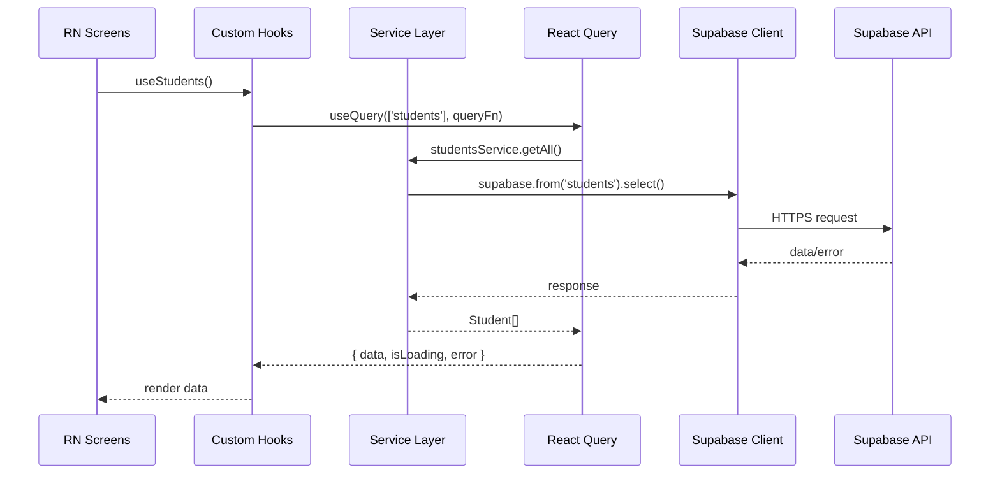
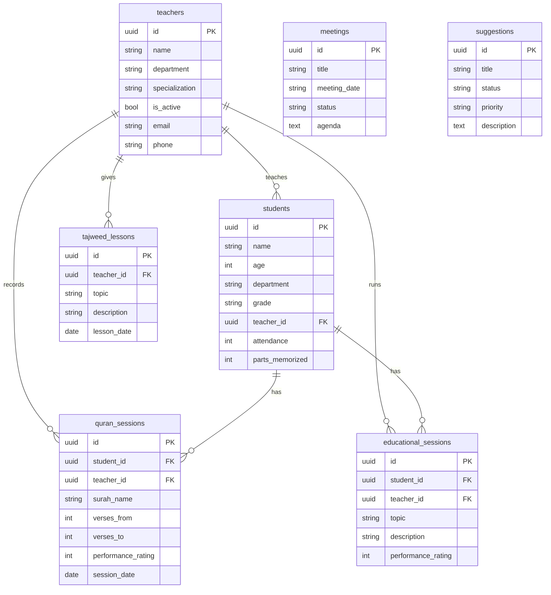

# Eqraa Center Hub - Mobile App Specification v2.0

> **Enhanced specification incorporating Expert Panel recommendations**
> **Version**: 2.0 | **Date**: 2026-01-04 | **Status**: Ready for Implementation

---

## 1) Goal & Vision

Build an Expo (React Native) mobile app that mirrors the web app in **look & feel**, **Arabic RTL**, and **full functionality** with all 16+ features.

**Web Reference Implementation:**
- Home dashboard: [`Index`](../src/views/Index.tsx:153)
- Auth UI: [`Login()`](../src/views/Login.tsx:16)
- Route protection: [`ProtectedLayout()`](../app/(protected)/layout.tsx:7)
- Home stats: [`useHomeStats()`](../src/hooks/useHomeStats.ts:82)
- Supabase types: [`Database`](../src/integrations/supabase/types.ts:9)

---

## 2) User Personas & Goals

### Primary Actors

| Persona | Role | Primary Goals | Key Screens | Priority |
|---------|------|---------------|-------------|----------|
| **معلم القرآن** (Quran Teacher) | Records student memorization | Log sessions, track progress, view circle | Quran, Students, Attendance | P0 |
| **مدير المعهد** (Director) | Oversees operations | View stats, manage teachers, announcements | Home, Management, Settings | P0 |
| **المعلم التربوي** (Educational Teacher) | Conducts sessions | Record sessions, track attendance, notes | Educational, Students | P1 |
| **ولي الأمر** (Parent) | Monitors child | View attendance, progress, announcements | Students (read-only) | P2 |
| **طالب** (Student) | Views own progress | Check memorization, upcoming exams | Home (limited) | P2 |

### Use Case Priority Matrix

| Use Case | Actor(s) | Frequency | Priority |
|----------|----------|-----------|----------|
| Log Quran session | Quran Teacher | 10-20/day | P0 |
| View dashboard stats | Director | 2-3/day | P0 |
| Mark attendance | All Teachers | 1/day | P1 |
| Add new student | Director | 1-2/week | P2 |
| View announcements | All | On-demand | P2 |

---

## 3) Scope

### In Scope
- **Platforms**: Android + iOS
- **Framework**: Expo SDK 52+
- **Routing**: Expo Router (file-based)
- **Auth**: Supabase Auth (email/password)
- **Session**: SecureStore persistence (NOT AsyncStorage)
- **State**: React Query + React Hook Form + Zod
- **Styling**: NativeWind (Tailwind-like)
- **Arabic RTL**: I18nManager + Noto Sans Arabic
- **Theming**: Light/dark with persistence
- **Features**: All 16+ sections with full CRUD
- **Offline**: Cached data display, queued mutations

### Phased Rollout
- **Phase 1-4**: Foundation + Auth + UI + Home (read-only data)
- **Phase 5-7**: Full CRUD for Students, Quran, Educational, Management
- **Phase 8**: Polish + Release

---

## 4) Non-Functional Requirements

### Performance (NFR-P)

| ID | Requirement | Target | Measurement |
|----|-------------|--------|-------------|
| NFR-P01 | App cold start time | < 3 seconds | Firebase Test Lab on Pixel 4a |
| NFR-P02 | List screen render (50+ items) | 60fps | React Native Performance Monitor |
| NFR-P03 | API response display | < 2 seconds on 3G | Network throttling test |
| NFR-P04 | Memory usage | < 150MB active | Android Profiler |
| NFR-P05 | Bundle size | < 50MB | EAS Build output |

### Security (NFR-S)

| ID | Requirement | Implementation |
|----|-------------|----------------|
| NFR-S01 | Session tokens stored securely | expo-secure-store (NOT AsyncStorage) |
| NFR-S02 | Certificate pinning | Supabase API calls only |
| NFR-S03 | Biometric authentication | Optional via expo-local-authentication |
| NFR-S04 | Sensitive data logging | Never log tokens, passwords, PII |
| NFR-S05 | Screen capture protection | Disable on sensitive screens (Android) |

### Availability (NFR-A)

| ID | Requirement | Behavior |
|----|-------------|----------|
| NFR-A01 | Offline data display | Show cached React Query data |
| NFR-A02 | Offline mutation queuing | Queue CRUD ops, sync on reconnect |
| NFR-A03 | Network retry | Exponential backoff (1s, 2s, 4s, max 30s) |
| NFR-A04 | Crash-free rate | > 99.5% sessions |
| NFR-A05 | Session persistence | Valid for 7 days, auto-refresh |

---

## 5) Navigation Architecture

### 5 Bottom Tabs

| Tab | Name | Screens |
|-----|------|---------|
| 1 | الرئيسية (Home) | Dashboard, Stats, Quick Navigation Grid |
| 2 | القرآن (Quran) | Sessions, Tajweed, Circles, Progress |
| 3 | الطلاب (Students) | List, Details, Attendance, Grades |
| 4 | الإدارة (Management) | Teachers, Exams, Schedule, Subjects, Meetings, Announcements, Library, Suggestions |
| 5 | الإعدادات (Settings) | Profile, Theme, Logout |

### Route Structure (Expo Router)

```
mobile/app/
├── _layout.tsx                 # Root layout with providers
├── (auth)/
│   ├── login.tsx
│   └── signup.tsx
├── (tabs)/
│   ├── _layout.tsx            # Tab bar configuration
│   ├── index.tsx              # Home/Dashboard
│   ├── quran/
│   │   ├── _layout.tsx
│   │   ├── index.tsx          # Sessions list
│   │   ├── tajweed.tsx
│   │   └── circles.tsx
│   ├── students/
│   │   ├── _layout.tsx
│   │   ├── index.tsx          # Students list
│   │   └── [id].tsx           # Student detail
│   ├── management/
│   │   ├── _layout.tsx
│   │   ├── index.tsx          # Management hub
│   │   ├── teachers.tsx
│   │   ├── exams.tsx
│   │   ├── schedule.tsx
│   │   ├── attendance.tsx
│   │   ├── announcements.tsx
│   │   ├── meetings.tsx
│   │   └── suggestions.tsx
│   └── settings/
│       ├── _layout.tsx
│       ├── index.tsx
│       └── profile.tsx
└── +not-found.tsx
```

### Navigation Flow

```mermaid
flowchart TD
  A[App Start] --> B{Session exists?}
  B -- No --> C[(auth)/login]
  C --> D[(auth)/signup]
  B -- Yes --> E[(tabs)/home]

  E --> F[(tabs)/quran]
  E --> G[(tabs)/students]
  E --> H[(tabs)/management]
  E --> I[(tabs)/settings]

  F --> F1[Sessions]
  F --> F2[Tajweed]
  F --> F3[Circles]

  G --> G1[Student List]
  G1 --> G2[Student Detail]

  H --> H1[Teachers]
  H --> H2[Exams]
  H --> H3[Schedule]
  H --> H4[Meetings]
  H --> H5[Suggestions]
```

---

## 6) Technical Architecture

### Layer Architecture

```
┌─────────────────────────────────────────────┐
│  UI Layer (app/ screens)                    │
│  - Presentation components only             │
│  - Uses hooks for data and state            │
└─────────────────┬───────────────────────────┘
                  │
┌─────────────────▼───────────────────────────┐
│  Hook Layer (src/hooks/)                    │
│  - useStudents, useQuranSessions, etc.      │
│  - React Query for caching                  │
│  - Loading/error state management           │
└─────────────────┬───────────────────────────┘
                  │
┌─────────────────▼───────────────────────────┐
│  Service Layer (src/services/)              │
│  - studentsService, quranService, etc.      │
│  - Pure functions, no React dependencies    │
│  - Easily mockable for testing              │
└─────────────────┬───────────────────────────┘
                  │
┌─────────────────▼───────────────────────────┐
│  Data Layer (src/lib/supabase.ts)           │
│  - Single Supabase instance                 │
│  - Type-safe queries                        │
│  - SecureStore for auth tokens              │
└─────────────────────────────────────────────┘
```

### Data Flow



### Supabase Client (React Native)

```typescript
// src/lib/supabase.ts
import 'react-native-url-polyfill/auto';
import { createClient } from '@supabase/supabase-js';
import * as SecureStore from 'expo-secure-store';

const secureStorage = {
  getItem: (key: string) => SecureStore.getItemAsync(key),
  setItem: (key: string, value: string) => SecureStore.setItemAsync(key, value),
  removeItem: (key: string) => SecureStore.deleteItemAsync(key),
};

export const supabase = createClient(
  process.env.EXPO_PUBLIC_SUPABASE_URL!,
  process.env.EXPO_PUBLIC_SUPABASE_ANON_KEY!,
  {
    auth: {
      storage: secureStorage,
      autoRefreshToken: true,
      persistSession: true,
      detectSessionInUrl: false,
    },
  }
);
```

### Service Layer Example

```typescript
// src/services/studentsService.ts
import { supabase } from '@/lib/supabase';
import { Student, StudentFilters, ServiceError } from '@/types';

export const studentsService = {
  async getAll(filters?: StudentFilters): Promise<Student[]> {
    let query = supabase.from('students').select('*, teachers(name)');

    if (filters?.department) {
      query = query.eq('department', filters.department);
    }
    if (filters?.isActive !== undefined) {
      query = query.eq('is_active', filters.isActive);
    }

    const { data, error } = await query.order('name');

    if (error) {
      throw new ServiceError('FETCH_STUDENTS_FAILED', error.message);
    }
    return data ?? [];
  },

  async getById(id: string): Promise<Student> {
    const { data, error } = await supabase
      .from('students')
      .select('*, teachers(name), quran_sessions(*)')
      .eq('id', id)
      .single();

    if (error) {
      throw new ServiceError('FETCH_STUDENT_FAILED', error.message);
    }
    return data;
  },

  async create(student: CreateStudentInput): Promise<Student> {
    const { data, error } = await supabase
      .from('students')
      .insert(student)
      .select()
      .single();

    if (error) {
      throw new ServiceError('CREATE_STUDENT_FAILED', error.message);
    }
    return data;
  },
};
```

---

## 7) Error Handling Architecture

### Error Categories

| Category | Example | User Experience | Technical Response |
|----------|---------|-----------------|-------------------|
| **Network** | No internet | Offline banner + cached data | Retry with exponential backoff |
| **Auth** | Token expired | Redirect to login + message | Clear session, redirect |
| **Validation** | Invalid form | Inline field errors (Arabic) | Zod validation |
| **Server** | 500 error | Error toast + retry button | Log to Sentry, retry 3x |
| **Not Found** | Deleted record | "Not found" screen | Navigate back |

### Error Boundary Hierarchy

```typescript
// app/_layout.tsx
<AppErrorBoundary fallback={<CrashScreen />}>
  <QueryClientProvider client={queryClient}>
    <AuthProvider>
      <ThemeProvider>
        <NetworkProvider>
          <Slot />
        </NetworkProvider>
      </ThemeProvider>
    </AuthProvider>
  </QueryClientProvider>
</AppErrorBoundary>

// Each tab has its own boundary
// app/(tabs)/_layout.tsx
<TabErrorBoundary fallback={<TabErrorScreen />}>
  <Tabs>...</Tabs>
</TabErrorBoundary>
```

### Offline Mode Behavior

```
┌─────────────────────────────────────────────┐
│  📶 Network Status: OFFLINE                 │
├─────────────────────────────────────────────┤
│  ✓ Show persistent offline banner (top)    │
│  ✓ Display cached data from React Query    │
│  ✓ Queue mutations in offline queue        │
│  ✓ Disable actions requiring network       │
│  ✓ Show sync indicator when reconnected    │
│  ✓ Auto-sync queued mutations on reconnect │
└─────────────────────────────────────────────┘
```

### Error Messages (Arabic)

| Error Type | Arabic Message |
|------------|----------------|
| Network error | "لا يوجد اتصال بالإنترنت" |
| Session expired | "انتهت صلاحية الجلسة، يرجى تسجيل الدخول مرة أخرى" |
| Invalid credentials | "بيانات الدخول غير صحيحة" |
| Server error | "حدث خطأ في الخادم، يرجى المحاولة لاحقاً" |
| Not found | "العنصر غير موجود" |
| Validation error | "يرجى التحقق من البيانات المدخلة" |

---

## 8) Behavioral Specifications

### Authentication Flow

```gherkin
Feature: User Authentication

  Scenario: Successful login with valid credentials
    Given the user is on the login screen
    And the user enters email "teacher@eqraa.edu"
    And the user enters password "ValidPassword123"
    When the user taps "تسجيل الدخول" button
    Then the app navigates to the home dashboard
    And the session token is stored in SecureStore
    And the user sees their name in the header

  Scenario: Login with invalid credentials
    Given the user is on the login screen
    And the user enters email "invalid@test.com"
    And the user enters password "wrong"
    When the user taps "تسجيل الدخول" button
    Then an error toast appears with message "بيانات الدخول غير صحيحة"
    And the user remains on the login screen
    And the password field is cleared

  Scenario: Session expiration handling
    Given the user is logged in
    And the session token has expired
    When the user makes any API request
    Then the app redirects to the login screen
    And a toast appears with message "انتهت صلاحية الجلسة"

  Scenario: Biometric login (optional)
    Given biometric authentication is enabled
    And the user has a valid cached session
    When the user opens the app
    Then biometric prompt appears
    When the user authenticates successfully
    Then the app navigates to home dashboard
```

### Quran Session Recording

```gherkin
Feature: Quran Session Recording

  Scenario: Record successful memorization session
    Given the teacher is on the Quran sessions screen
    And they tap "إضافة جلسة جديدة"
    When they select student "أحمد محمد"
    And enter surah "البقرة"
    And enter verses from "1" to "5"
    And select rating "8"
    And tap "حفظ"
    Then the session is saved to database
    And success toast appears "تم حفظ الجلسة بنجاح"
    And the session appears in the list

  Scenario: Record session while offline
    Given the device is offline
    And the teacher records a new session
    When they tap "حفظ"
    Then the session is queued for sync
    And info toast appears "سيتم الحفظ عند عودة الاتصال"
    When the device reconnects
    Then the session syncs automatically
    And success toast appears "تم مزامنة البيانات"
```

### RTL Layout Behavior

```gherkin
Feature: RTL Arabic Support

  Scenario: Navigation direction
    Given the app is launched
    Then the back button appears on the right side
    And text flows from right to left
    And list items align to the right

  Scenario: Form field alignment
    Given the user is on any form screen
    Then labels appear on the right of fields
    And placeholder text is right-aligned
    And validation errors appear below fields, right-aligned
```

---

## 9) Project Structure

```
mobile/
├── app/                        # Expo Router screens
│   ├── _layout.tsx            # Root layout with providers
│   ├── (auth)/
│   │   ├── _layout.tsx
│   │   ├── login.tsx
│   │   └── signup.tsx
│   ├── (tabs)/
│   │   ├── _layout.tsx
│   │   ├── index.tsx
│   │   ├── quran/
│   │   ├── students/
│   │   ├── management/
│   │   └── settings/
│   └── +not-found.tsx
├── src/
│   ├── components/
│   │   ├── ui/                # Button, Card, Input, Select, Dialog
│   │   ├── common/            # PageHeader, StatCard, IconButton
│   │   ├── forms/             # FormField, PasswordInput, SearchInput
│   │   ├── feedback/          # Toast, ErrorBoundary, OfflineBanner
│   │   └── features/          # students/, teachers/, quran/
│   ├── hooks/
│   │   ├── useAuth.ts
│   │   ├── useHomeStats.ts
│   │   ├── useStudents.ts
│   │   ├── useNetwork.ts
│   │   └── useTheme.ts
│   ├── services/              # NEW: Service layer
│   │   ├── studentsService.ts
│   │   ├── teachersService.ts
│   │   ├── quranService.ts
│   │   └── authService.ts
│   ├── lib/
│   │   ├── supabase.ts
│   │   ├── validations.ts
│   │   ├── utils.ts
│   │   └── errors.ts          # NEW: Error classes
│   ├── types/
│   │   ├── index.ts
│   │   └── supabase.ts
│   ├── contexts/
│   │   ├── AuthContext.tsx
│   │   ├── ThemeContext.tsx
│   │   └── NetworkContext.tsx # NEW: Network state
│   └── constants/
│       ├── colors.ts
│       ├── navigation.ts
│       └── errors.ts          # NEW: Error messages
├── assets/
│   └── fonts/NotoSansArabic/
├── __tests__/                  # NEW: Test directory
│   ├── unit/
│   ├── integration/
│   └── e2e/
├── app.json
├── tailwind.config.js
├── babel.config.js
├── jest.config.js             # NEW: Jest config
├── detox.config.js            # NEW: Detox config
└── package.json
```

---

## 10) Data Model (Supabase)

Same tables as web app:



---

## 11) Screen-to-Data Mapping

| Screen | Web Reference | Data to Show | Tables/Fields |
|--------|---------------|--------------|---------------|
| Home | [`Index`](../src/views/Index.tsx:153) | Stats cards, navigation grid | `students`, `teachers`, `meetings` |
| Students | [`Students`](../src/views/Students.tsx) | List with search/filter, CRUD | `students.*`, `teachers.name` |
| Quran | [`Quran`](../src/views/Quran.tsx:54) | Sessions list, progress | `students` (quran), `quran_sessions` |
| Tajweed | [`Tajweed`](../src/views/Tajweed.tsx:20) | Lessons by date | `tajweed_lessons.*` |
| Educational | [`Educational`](../src/views/Educational.tsx:45) | Students, sessions | `students` (tarbawi), `educational_sessions` |
| Teachers | [`Teachers`](../src/views/Teachers.tsx) | Teachers list, CRUD | `teachers.*` |
| Meetings | [`Meetings`](../src/views/Meetings.tsx:38) | Meetings with filter | `meetings.*` |
| Suggestions | [`Suggestions`](../src/views/Suggestions.tsx:24) | Suggestions with badges | `suggestions.*` |

---

## 12) Code Reuse from Web

### Files to Copy Directly
| Web Path | Mobile Path | Changes |
|----------|-------------|---------|
| `/src/types/index.ts` | `/src/types/index.ts` | None |
| `/src/lib/validations.ts` | `/src/lib/validations.ts` | None |
| `/src/integrations/supabase/types.ts` | `/src/types/supabase.ts` | None |
| `/src/hooks/useHomeStats.ts` | `/src/hooks/useHomeStats.ts` | Import paths |
| `/src/hooks/useUserRole.ts` | `/src/hooks/useUserRole.ts` | Import paths |

### UI Component Mapping (Shadcn → NativeWind)
| Shadcn Component | React Native Equivalent |
|-----------------|------------------------|
| Button | Pressable + NativeWind + CVA |
| Card | View with shadow styles |
| Input | TextInput + NativeWind |
| Select | @react-native-picker or custom modal |
| Dialog | React Native Modal |
| Table | FlatList with custom rows |
| Toast | react-native-toast-message |
| Avatar | Image + fallback View |
| Badge | View + Text with variants |

---

## 13) Dependencies

```json
{
  "expo": "~52.0.0",
  "expo-router": "~4.0.0",
  "react": "18.3.1",
  "react-native": "0.76.0",

  "@supabase/supabase-js": "^2.89.0",
  "expo-secure-store": "~14.0.0",
  "react-native-url-polyfill": "^2.0.0",

  "@tanstack/react-query": "^5.90.0",
  "zod": "^4.2.1",
  "react-hook-form": "^7.69.0",
  "@hookform/resolvers": "^5.2.2",

  "nativewind": "^4.0.0",
  "tailwindcss": "^3.4.0",
  "class-variance-authority": "^0.7.1",
  "clsx": "^2.1.1",
  "tailwind-merge": "^3.4.0",

  "lucide-react-native": "^0.460.0",
  "expo-image-picker": "~16.0.0",
  "expo-local-authentication": "~14.0.0",
  "react-native-toast-message": "^2.2.0",
  "@react-native-community/netinfo": "^11.0.0",
  "date-fns": "^4.1.0",
  "@sentry/react-native": "^5.0.0"
}
```

**Dev Dependencies:**
```json
{
  "jest": "^29.0.0",
  "@testing-library/react-native": "^12.0.0",
  "detox": "^20.0.0",
  "msw": "^2.0.0"
}
```

---

## 14) Test Strategy

### Test Pyramid

```
           /\
          /  \  E2E Tests (Detox)
         /    \  5-10 critical journeys
        /──────\
       /        \
      / Integr.  \  Integration Tests (Jest + MSW)
     /   Tests    \  30-50 tests (hooks, services)
    /──────────────\
   /                \
  /   Unit Tests     \  Unit Tests (Jest)
 /────────────────────\  100+ tests (validation, utils)
```

### Coverage Targets

| Layer | Coverage Target | Tools |
|-------|-----------------|-------|
| Unit Tests | 80%+ | Jest |
| Integration | 60%+ | Jest + MSW |
| E2E | Critical paths | Detox |

### E2E Critical Journeys

1. **Authentication Journey**
   - Login → View Dashboard → Logout

2. **Student Management Journey**
   - Login → Add Student → View Student → Edit Student

3. **Quran Session Journey**
   - Login → Record Session → Verify in list

4. **Offline Journey**
   - Go offline → View cached data → Queue mutation → Reconnect → Verify sync

---

## 15) Observability & Monitoring

### Crash Reporting (Sentry)

```typescript
// app/_layout.tsx
import * as Sentry from '@sentry/react-native';

Sentry.init({
  dsn: process.env.EXPO_PUBLIC_SENTRY_DSN,
  tracesSampleRate: 0.2,
  beforeSend(event) {
    // Strip sensitive data
    delete event.user?.email;
    return event;
  },
});
```

### Analytics Events

| Event | Parameters | Trigger |
|-------|------------|---------|
| `screen_view` | screen_name, user_role | Screen mount |
| `login_success` | method | Successful login |
| `login_failure` | error_type | Failed login |
| `crud_action` | entity, action, success | CRUD operation |
| `offline_action` | action_type | Offline mutation queued |
| `sync_complete` | items_synced | Offline sync done |

### Performance Metrics

| Metric | Target | Tool |
|--------|--------|------|
| App startup | < 3s | Firebase Performance |
| Screen TTI | < 1s | Firebase Performance |
| API latency | < 500ms | Sentry |
| Crash-free rate | > 99.5% | Sentry |

---

## 16) Implementation Phases

### Phase 1: Foundation
- [ ] Initialize Expo project with TypeScript
- [ ] Configure NativeWind + Tailwind
- [ ] Set up Expo Router navigation structure
- [ ] Configure Supabase client with SecureStore
- [ ] Implement RTL support (I18nManager.forceRTL)
- [ ] Create ThemeContext (light/dark mode)
- [ ] Copy types and validations from web
- [ ] Load Arabic font (Noto Sans Arabic)
- [ ] Set up Sentry crash reporting

### Phase 2: Authentication
- [ ] Create Login screen (mirror web design)
- [ ] Create Signup screen
- [ ] Implement AuthContext with Supabase
- [ ] Set up protected route wrappers
- [ ] Implement session persistence (SecureStore)
- [ ] Add biometric authentication (optional)
- [ ] Implement error handling for auth flows

### Phase 3: Core UI Components
- [ ] Button (all variants)
- [ ] Card, Input, Select
- [ ] Dialog/Modal, Avatar, Badge
- [ ] Tabs, Toast notifications
- [ ] PageHeader, StatCard, IconButton
- [ ] LoadingSpinner, Skeleton, EmptyState
- [ ] OfflineBanner, ErrorBoundary

### Phase 4: Home Dashboard
- [ ] Dashboard layout with stats cards
- [ ] Navigation grid (16 sections)
- [ ] Announcements preview
- [ ] Pull-to-refresh
- [ ] Integrate useHomeStats hook
- [ ] Implement network status monitoring

### Phase 5: Students Module
- [ ] Create service layer (studentsService)
- [ ] Students list (FlatList with search/filter)
- [ ] Student detail screen
- [ ] Add/Edit student forms
- [ ] Attendance tracking
- [ ] Memorization progress with images
- [ ] Image upload with Supabase Storage
- [ ] Unit tests for service layer

### Phase 6: Quran & Educational
- [ ] Create service layers (quranService, educationalService)
- [ ] Quran sessions screen with CRUD
- [ ] Tajweed lessons screen with CRUD
- [ ] Quran circles screen
- [ ] Educational programs hub (6 sections)
- [ ] Session recording forms
- [ ] Integration tests for hooks

### Phase 7: Management Features
- [ ] Create service layers (managementService)
- [ ] Teachers management (CRUD)
- [ ] Exams management
- [ ] Schedule viewer
- [ ] Subjects management
- [ ] Attendance system
- [ ] Meetings management
- [ ] Announcements
- [ ] Library resources
- [ ] Suggestions/Feedback

### Phase 8: Polish & Release
- [ ] Performance optimization
- [ ] Offline mode implementation
- [ ] E2E tests (Detox)
- [ ] App icons and splash screen
- [ ] Build production APK/IPA
- [ ] Submit to App Store / Play Store

---

## 17) Acceptance Criteria

### Phase 1-4 (Foundation) - Measurable Criteria

| ID | Criterion | Test Type | Target |
|----|-----------|-----------|--------|
| AC-01 | Session-based routing | Automated | Login shown when no token |
| AC-02 | RTL layout | Visual regression | 0 breaks |
| AC-03 | Theme persistence | Unit | Persists after restart |
| AC-04 | Session persistence | Integration | Valid after 24h |
| AC-05 | Dashboard stats | E2E | Match DB within 1min |
| AC-06 | Cold start time | Performance | < 3s on Pixel 4a |

### Phase 5-7 (Full Features) - Measurable Criteria

| ID | Criterion | Test Type | Target |
|----|-----------|-----------|--------|
| AC-07 | Student CRUD | Integration | All ops work |
| AC-08 | Form validation | Unit | Zod errors shown |
| AC-09 | Image upload | E2E | Upload completes |
| AC-10 | Offline caching | Integration | Data shows offline |
| AC-11 | Mutation queue | Integration | Syncs on reconnect |

### Phase 8 (Release) - Measurable Criteria

| ID | Criterion | Test Type | Target |
|----|-----------|-----------|--------|
| AC-12 | Android performance | Test Lab | Startup < 3s |
| AC-13 | iOS performance | XCTest | Startup < 3s |
| AC-14 | Crash-free rate | Crashlytics | > 99.5% |
| AC-15 | E2E pass rate | Detox | 100% |
| AC-16 | Bundle size | Build | < 50MB |

---

## 18) Environment Configuration

### Mobile `.env`
```bash
EXPO_PUBLIC_SUPABASE_URL=https://rmdslhisibrpdnamiuln.supabase.co
EXPO_PUBLIC_SUPABASE_ANON_KEY=<anon-key-from-web-.env>
EXPO_PUBLIC_SENTRY_DSN=<sentry-dsn>
```

### EAS Build Configuration
```json
// eas.json
{
  "build": {
    "development": {
      "developmentClient": true,
      "distribution": "internal"
    },
    "preview": {
      "distribution": "internal"
    },
    "production": {}
  }
}
```

---

## Revision History

| Version | Date | Changes |
|---------|------|---------|
| 1.0 | 2026-01-04 | Initial specification |
| 2.0 | 2026-01-04 | Expert panel recommendations incorporated |

### Changes in v2.0
- Added User Personas & Goals (Section 2)
- Added Non-Functional Requirements (Section 4)
- Added Service Layer Architecture (Section 6)
- Added Error Handling Architecture (Section 7)
- Added Behavioral Specifications (Section 8)
- Added Test Strategy (Section 14)
- Added Observability & Monitoring (Section 15)
- Enhanced Acceptance Criteria with measurable targets (Section 17)
- Changed session storage from AsyncStorage to SecureStore
