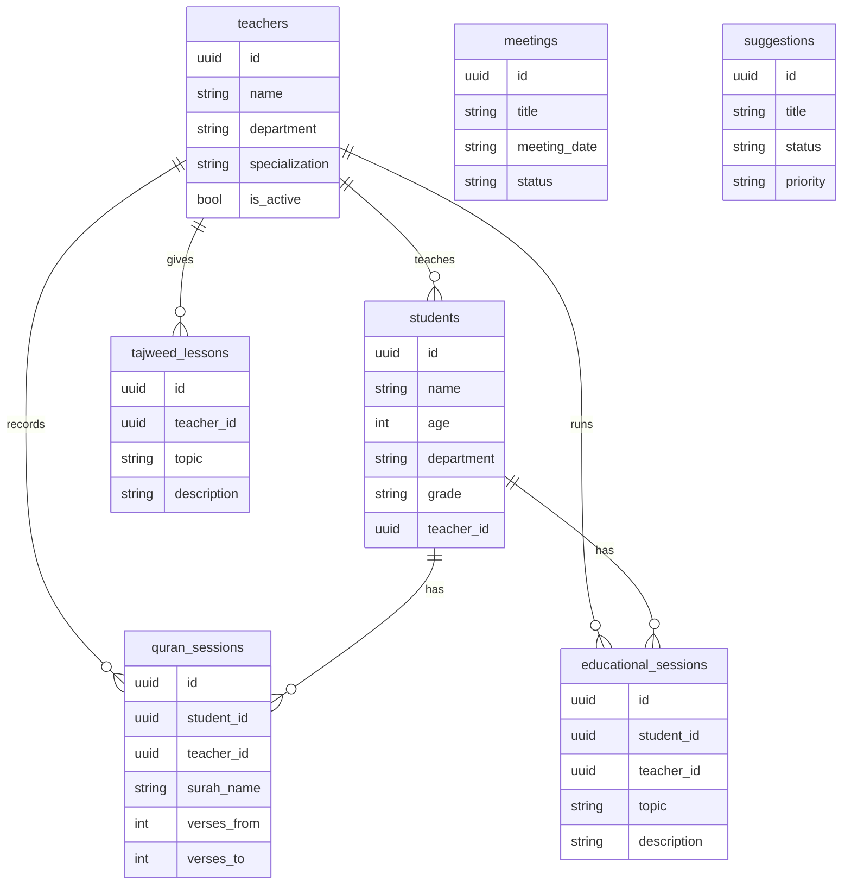
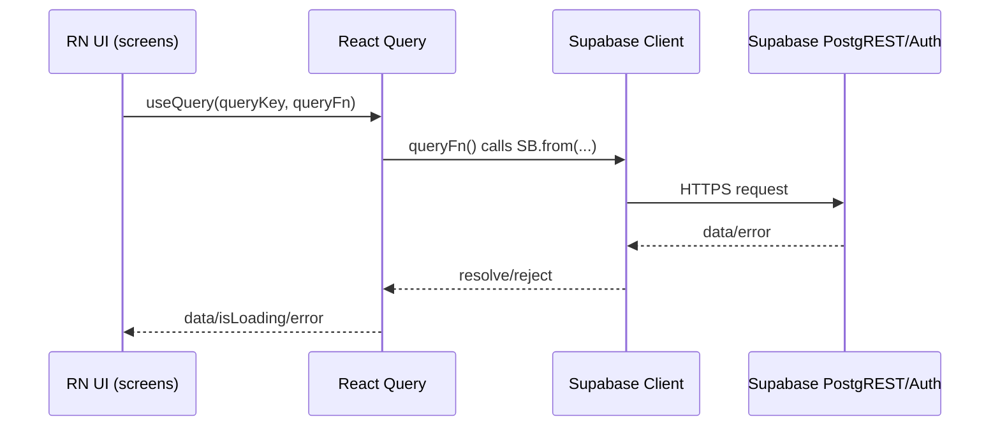

# Expo / React Native (Expo Router) Mobile App Plan (v1)

## 1) Goal

Build an Expo (React Native) mobile app that mirrors the current web app in this repo (Next.js) in **look & feel**, **Arabic RTL**, and **core navigation**, with **read-only** data screens for v1.

Web reference implementation:

- Home dashboard and sections list: [`Index`](src/views/Index.tsx:153)
- Auth UI baseline: [`Login()`](src/views/Login.tsx:16)
- Route protection logic: [`ProtectedLayout()`](<app/(protected)/layout.tsx:7>)
- Home stats query logic: [`useHomeStats()`](src/hooks/useHomeStats.ts:82)
- Supabase schema types: [`Database`](src/integrations/supabase/types.ts:9)

## 2) Scope (v1)

### In scope

- **Platforms**: Android + iOS
- **Framework**: Expo SDK 51+
- **Routing**: Expo Router
- **Auth**: Supabase Auth (email/password)
- **Session persistence**: `@react-native-async-storage/async-storage`
- **State/query**: React Query (`@tanstack/react-query`)
- **UI styling**: NativeWind (Tailwind-like)
- **Arabic RTL**: layout direction + Noto Sans Arabic
- **Theming**: light/dark with persistence
- **Navigation**: bottom tabs for major sections + stack for deeper screens

### Out of scope (v1)

- CRUD actions (create/update/delete) across all domain entities
- Audio recording/upload flows in Quran module (present in web in [`Quran`](src/views/Quran.tsx:194))
- Push notifications
- Offline-first mode

## 3) Product decisions captured

1. **Supabase**: Use the same Supabase project as web.
2. **Env**: Copy Supabase values from repo [`.env`](../.env) into [`mobile/.env`](../mobile/.env) during setup.
3. **Navigation**: Bottom tabs (Home + 5 sections) plus stack for detail screens.

## 4) Information Architecture

### Tabs

We use 6 tabs:

1. Home
2. Admin
3. Quran
4. Tajweed
5. Educational
6. More (contains Meetings + Suggestions as list items)

Rationale: tabs stay <= 6 for usability; Meetings + Suggestions are important but can live under “More” in v1.

### Route groups (Expo Router)

```
mobile/app/
  (auth)/
    login.tsx
    signup.tsx
  (tabs)/
    _layout.tsx
    home.tsx
    admin.tsx
    quran.tsx
    tajweed.tsx
    educational.tsx
    more.tsx
  (stack)/
    meetings.tsx
    suggestions.tsx
```

### Navigation diagram

```mermaid
flowchart TD
  A[App Start] --> B{Session exists?}
  B -- No --> C[(auth)/login]
  C --> D[(auth)/signup]
  B -- Yes --> E[(tabs)/home]

  E --> F[(tabs)/admin]
  E --> G[(tabs)/quran]
  E --> H[(tabs)/tajweed]
  E --> I[(tabs)/educational]
  E --> J[(tabs)/more]

  J --> K[(stack)/meetings]
  J --> L[(stack)/suggestions]
```

## 5) Data model (Supabase)

The mobile app will query the same tables already used by the web app.

Primary tables (from [`Database`](src/integrations/supabase/types.ts:9)):

- `students`
- `teachers`
- `quran_sessions`
- `educational_sessions`
- `tajweed_lessons`
- `meetings`
- `suggestions`
- `user_roles`
- `activities` (optional in v1)

### ER diagram (simplified)



## 6) Screen-to-data mapping (read-only v1)

| Screen      | Web reference                                                                         | Read-only data to show                                                   | Tables / fields                                                                                   |
| ----------- | ------------------------------------------------------------------------------------- | ------------------------------------------------------------------------ | ------------------------------------------------------------------------------------------------- |
| Home        | [`Index`](src/views/Index.tsx:153) + [`useHomeStats()`](src/hooks/useHomeStats.ts:82) | total students, attendance %, active circles proxy, upcoming exams proxy | `students.is_active`, `students.attendance`, `teachers.is_active`, `meetings.meeting_date/status` |
| Admin       | [`Admin`](src/views/Admin.tsx:37)                                                     | teachers list + students list + totals                                   | `teachers.*`, `students.*`                                                                        |
| Quran       | [`Quran`](src/views/Quran.tsx:54)                                                     | Quran students list + last N sessions                                    | `students` filtered `department='quran'` + `quran_sessions` joined with students                  |
| Tajweed     | [`Tajweed`](src/views/Tajweed.tsx:20)                                                 | lessons list sorted by date desc                                         | `tajweed_lessons.*`                                                                               |
| Educational | [`Educational`](src/views/Educational.tsx:45)                                         | students list (tarbawi) + last N sessions                                | `students` filtered `department='tarbawi'` + `educational_sessions` joined                        |
| Meetings    | [`Meetings`](src/views/Meetings.tsx:38)                                               | meetings list + optional type/status filter                              | `meetings.*`                                                                                      |
| Suggestions | [`Suggestions`](src/views/Suggestions.tsx:24)                                         | suggestions list + priority/status badges                                | `suggestions.*`                                                                                   |

## 7) Technical architecture

### High-level data flow



### Providers (mobile)

- Theme provider (light/dark)
- React Query provider
- Auth/session provider (listens to Supabase auth changes)

## 8) Project structure (mobile)

Target structure under [`mobile/`](../mobile):

```
mobile/
  app/
    (auth)/
    (tabs)/
    (stack)/
  src/
    components/
    hooks/
    lib/
    theme/
  assets/
  app.json
  package.json
```

## 9) UI parity rules

1. RTL-first layouts.
2. Keep typography consistent with web: Noto Sans Arabic (see web font in [`RootLayout`](app/layout.tsx:20)).
3. Use icon strategy compatible with RN (prefer `lucide-react-native`).
4. Keep spacing tokens aligned to Tailwind scale.

## 10) Environment configuration

Mobile `.env` keys (copied from web):

- `EXPO_PUBLIC_SUPABASE_URL`
- `EXPO_PUBLIC_SUPABASE_ANON_KEY`

Mapping: web uses `NEXT_PUBLIC_*` in [`createSupabaseClient()`](src/integrations/supabase/client.ts:9); mobile uses `EXPO_PUBLIC_*` to satisfy Expo env conventions.

## 11) Milestones / TODO (execution order)

- [ ] Scaffold Expo app (Expo Router “tabs” template) under `mobile/`
- [ ] Add NativeWind + Tailwind config
- [ ] Add React Query provider
- [ ] Add Supabase RN client (AsyncStorage persistence)
- [ ] Implement RTL + Arabic font loading
- [ ] Implement theme toggle + persistence
- [ ] Build (auth): Login + Signup
- [ ] Build (tabs): Home + Admin + Quran + Tajweed + Educational + More
- [ ] Build (stack): Meetings + Suggestions
- [ ] Wire read-only data queries and loading/error UX
- [ ] Validate on device (Android + iOS)
- [ ] Document setup + run instructions

## 12) Acceptance criteria (v1)

1. App boots into auth or tabs depending on session.
2. RTL layout works across all screens.
3. Light/dark toggle persists and affects the whole UI.
4. Supabase session persists across app restarts.
5. Each v1 screen displays data without crashes (empty states ok).
