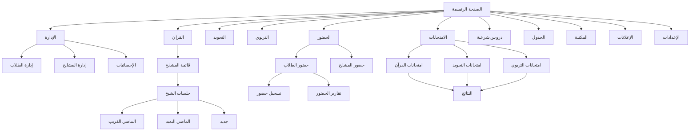
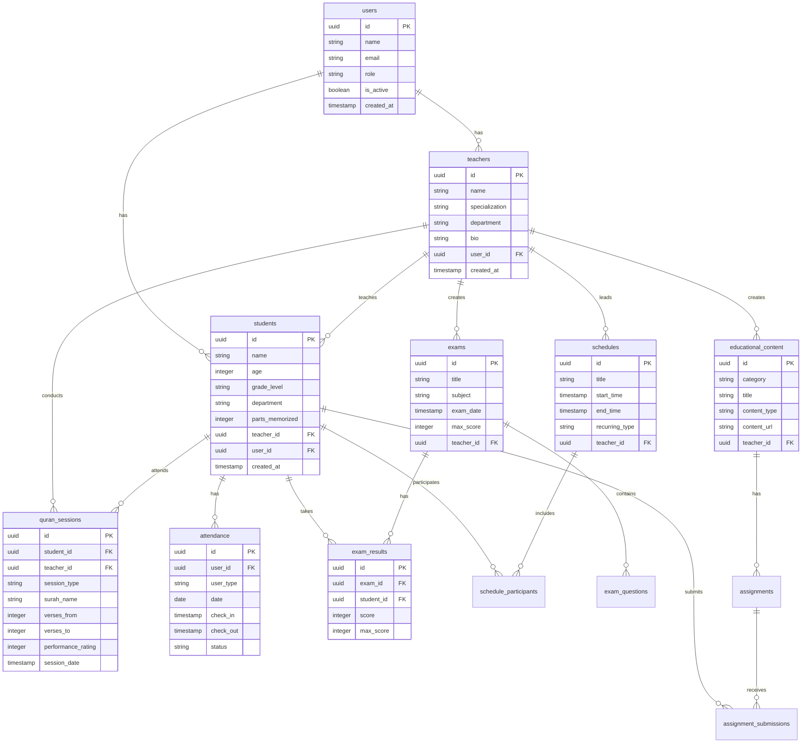
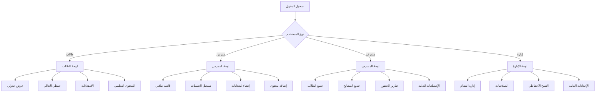
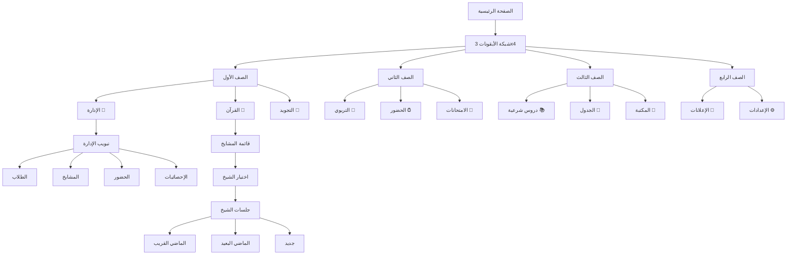
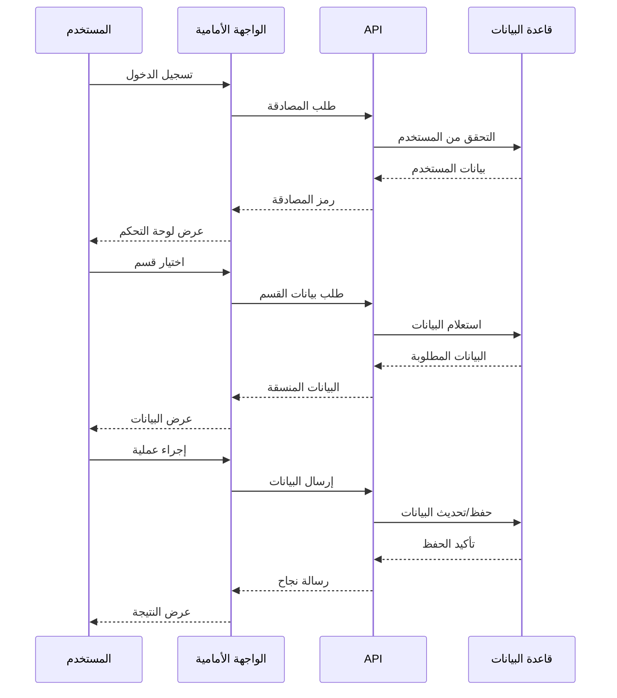
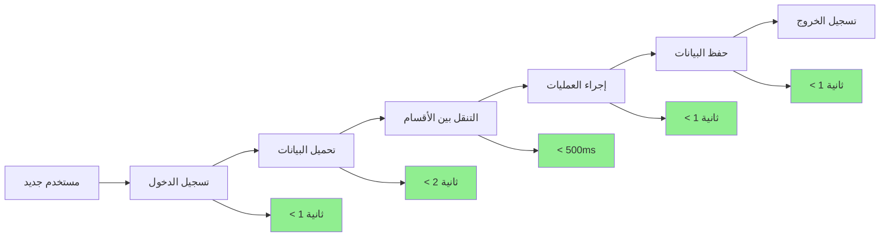
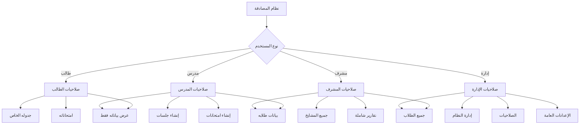
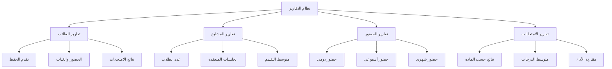
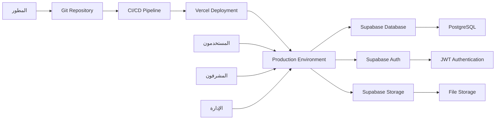
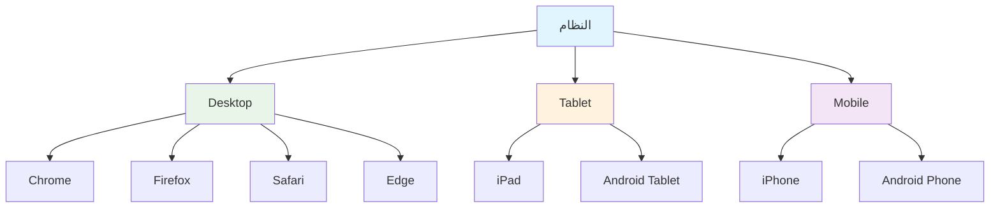

# مخطط انسيابي لنظام مركز إقرا المحدث

## 🔄 المخطط العام للنظام

## 📊 مخطط قاعدة البيانات

## 🎯 مخطط تدفق المستخدم

## 📱 مخطط واجهة المستخدم

## 🔄 مخطط تدفق البيانات

## 📈 مخطط أداء النظام

## 🔐 مخطط الصلاحيات والأمان

## 📊 مخطط التقارير والإحصائيات

## 🚀 مخطط النشر والتشغيل

## 📱 مخطط التوافقية

---

هذا المخطط الانسيابي يوضح جميع جوانب النظام والعلاقات بين المكونات المختلفة، مما يساعد في فهم Architecture النظام بشكل كامل قبل البدء في التنفيذ.
